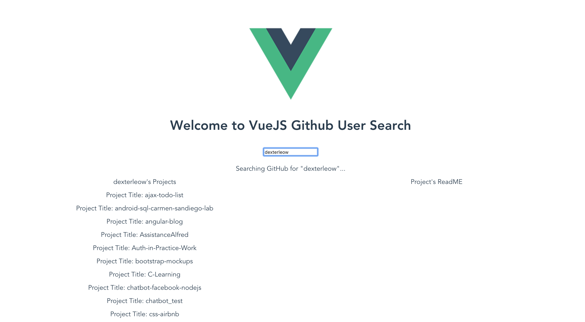

# VueJS_Github_User_Project_Search

## Project setup
```
npm install
```

### Compiles and hot-reloads for development
```
npm run serve
```

### Compiles and minifies for production
```
npm run build
```
### Run your tests at test folder (Basic API test with Mocha)
```
mocha 
```
<!-- ### Lints and fixes files
```
npm run lint
``` -->

### Screenshots of Project

#### Project's Landing Page:


#### After searching for a user, dexterleow, it will showcase dexterleow's github projects:



#### When clicked on a specific project, the project readme will appear on the right


#### When clicked on a specific project, and the readme can't be found, it will show an error message "There was an error loading contents :/"


### Customize configuration
See [Configuration Reference](https://cli.vuejs.org/config/).

